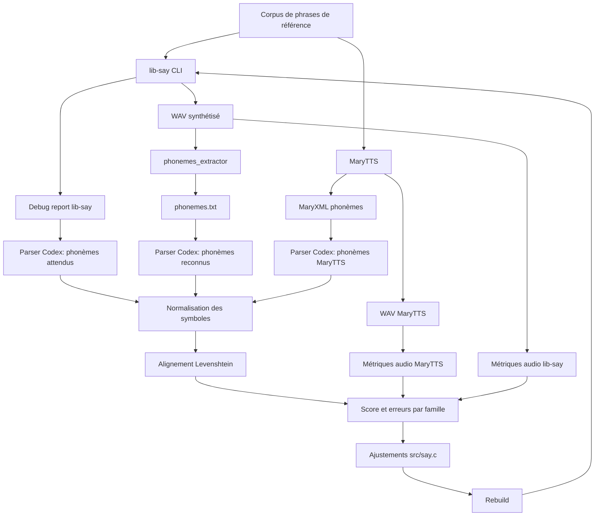
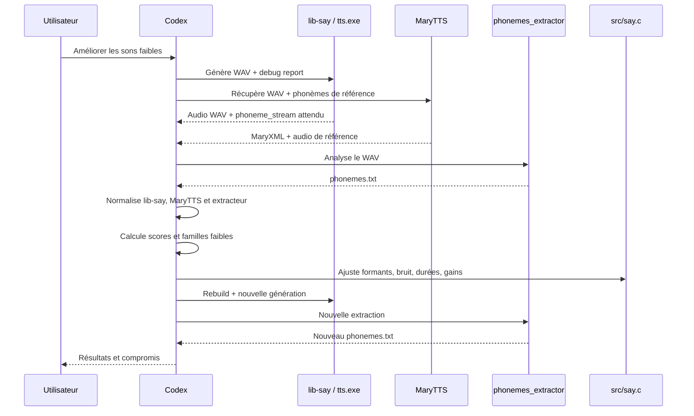
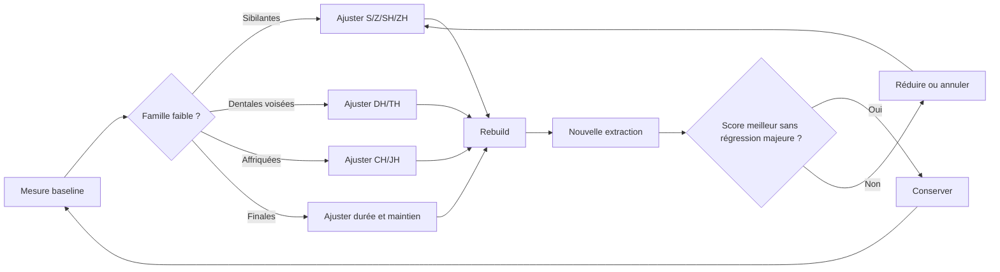

# Workflow de feedback phonétique par speech-to-text

## Objectif

Ce document décrit le workflow utilisé pour améliorer l'élocution de `lib-say` à partir du feedback d'un outil externe de reconnaissance phonétique : `reference/phonemes_extractor/phonemes.exe`.

L'idée n'est pas de considérer cet outil comme une vérité absolue. Il sert plutôt de capteur perceptif automatisé : si une phrase synthétisée par `lib-say` produit des phonèmes reconnus plus proches de la séquence attendue, alors l'articulation acoustique va probablement dans le bon sens.

Le workflow s'appuie aussi sur MaryTTS comme vérité terrain externe. Cette vérité terrain est perfectible, car MaryTTS a sa propre phonémisation, sa propre prosodie et ses propres choix acoustiques. Elle reste néanmoins utile comme référence de prononciation plus mature que `lib-say`, notamment pour comparer les séquences de phonèmes attendues, les durées globales et certains indicateurs audio.

Le workflow est itératif :

1. Générer un WAV avec `lib-say`.
2. Extraire les phonèmes reconnus par `phonemes_extractor`.
3. Comparer ces phonèmes avec le flux attendu par `lib-say`.
4. Comparer les choix phonétiques et métriques audio avec MaryTTS lorsque la référence existe.
5. Identifier les familles faibles : sibilantes, dentales voisées, affriquées, finales, etc.
6. Ajuster les paramètres acoustiques.
7. Recompiler et mesurer à nouveau.

## Vue d'ensemble



## Interaction entre les composants



## Pré-requis

Le workflow dépend de trois éléments :

- `bin/tts.exe`, construit depuis le dépôt.
- La sortie WAV de `lib-say`.
- `reference/phonemes_extractor/phonemes.exe`.
- MaryTTS, lorsque l'on veut comparer `lib-say` à une référence externe plus mature.

Depuis l'ajout du support WAV, `lib-say` peut générer directement :

```bat
bin\tts.exe "She sells seashells by the seashore." -o bin\reference-en\ours-03-sibilants.wav --lang en
```

Le rapport de debug donne la séquence de phonèmes attendue :

```bat
bin\tts.exe "She sells seashells by the seashore." --lang en --debug-report - --dry-run
```

`phonemes_extractor` écrit son résultat dans un fichier `phonemes.txt`. Pour éviter les ambiguïtés, il vaut mieux le lancer avec son répertoire comme working directory :

```bat
cd reference\phonemes_extractor
phonemes.exe C:\works\projects\lib-say\bin\reference-en\ours-03-sibilants.wav
```

Le fichier produit ressemble à ceci :

```text
[ours-03-sibilants.wav]  2210
ay  1270
_   1400
th  1580
ih  1657
```

## Données comparées

### Référence MaryTTS

MaryTTS joue le rôle de vérité terrain pragmatique.

Dans `bin/generate-reference-en.py`, MaryTTS est utilisée pour produire :

- un WAV de référence,
- un XML de phonèmes,
- des features de cible,
- des métriques audio comparables à celles de `lib-say`.

Cette référence est utile pour répondre à deux questions différentes :

- Est-ce que la séquence phonétique prévue par `lib-say` est proche d'une phonémisation externe crédible ?
- Est-ce que l'audio généré par `lib-say` ressemble, en durée et en énergie, à une synthèse plus mature ?

MaryTTS ne remplace pas `phonemes_extractor`. Les deux rôles sont différents :

| Outil | Rôle |
|---|---|
| MaryTTS | Vérité terrain externe pour la phonémisation, les durées et les métriques audio |
| phonemes_extractor | Feedback perceptif : ce qu'un outil de reconnaissance entend dans le WAV de `lib-say` |
| Debug report `lib-say` | Intention interne : ce que `lib-say` voulait produire |

MaryTTS est donc un oracle de référence, tandis que `phonemes_extractor` est un capteur de lisibilité acoustique.

### Séquence attendue

La séquence attendue vient du `debug report` de `lib-say`, section `phoneme_stream`.

Exemple :

```text
SH 'I / S 'EH L Z / S 'I SH EH L Z / B 'AH J / DH SCHWA / S 'I SH OH R [pause x2:sentence]
```

Elle est normalisée ainsi :

- suppression du marqueur de stress `'`,
- remplacement des séparateurs `/` par des espaces,
- remplacement des pauses textuelles `[pause ...]` par `PAUSE`.

### Séquence reconnue

La séquence reconnue vient de `phonemes.txt`.

L'outil utilise des symboles proches de l'ARPAbet. On les mappe vers les symboles internes de `lib-say`.

Exemples :

| Extracteur | lib-say |
|---|---|
| `ax` | `SCHWA` |
| `iy` | `I` |
| `ih` | `IH` |
| `uw` | `U` |
| `dh` | `DH` |
| `th` | `TH` |
| `sh` | `SH` |
| `z` | `Z` |
| `_` | `PAUSE` |

Certains phonèmes composés peuvent être développés :

| Extracteur | lib-say |
|---|---|
| `ay` | `AH J` |
| `ey` | `E J` |
| `ow` | `OH W` |
| `aw` | `AH W` |

## Score d'alignement

Le score utilisé pendant l'itération est volontairement simple :

```text
score = 1 - distance_levenshtein / max(len(attendu), len(reconnu), 1)
```

Ce score mesure la proximité globale entre les deux flux de phonèmes.

Il est utile pour comparer deux versions de `lib-say`, mais il ne doit pas être interprété comme un score objectif de qualité vocale. L'extracteur peut se tromper, surtout sur une voix synthétique formant-based, et il peut reconnaître une phrase plausible mais différente.

## Pourquoi ce score reste imparfait

`phonemes_extractor` est un outil de reconnaissance, pas un analyseur acoustique spécialisé pour `lib-say`.

Ses limites observées :

- stdout affiche surtout l'en-tête ; le résultat utile est dans `phonemes.txt`.
- Les scores MaryTTS via `phonemes_extractor` ne sont pas parfaits non plus sur le même corpus.
- Les phonèmes courts ou peu énergétiques sont souvent ignorés.
- Les fricatives voisées peuvent être confondues avec des fricatives non voisées.
- Un meilleur score global peut masquer une régression locale.

On utilise donc deux familles d'indicateurs :

- score d'alignement phonétique,
- métriques audio simples : durée, RMS, ZCR, `diff_mean`.

Le ZCR, ou zero-crossing rate, est particulièrement utile pour les fricatives : plus le signal contient de bruit haute fréquence, plus le ZCR augmente.

MaryTTS aide à contextualiser ces métriques. Par exemple, si `lib-say` a un ZCR très inférieur à MaryTTS sur une phrase riche en sibilantes, cela suggère que les fricatives de `lib-say` manquent d'énergie haute fréquence.

## Boucle d'amélioration



## Itération réalisée : sibilantes et dentales voisées

Les scores les plus faibles observés initialement étaient :

| Cas | Focus | Score initial |
|---|---:|---:|
| `03-sibilants` | `S`, `SH`, `Z` | `8.70%` |
| `05-voiced-dentals` | `DH`, `Z` | `5.88%` |

Les modifications ont ciblé [src/say.c](../src/say.c) :

- table `g_phonemes`,
- durée des segments fricatifs,
- `local_noise_mix`,
- enveloppe de segment,
- amplitude de frame,
- gains et bandes des formants hauts.

### Changements acoustiques appliqués

Pour `S/Z/SH/ZH` :

- durée légèrement augmentée,
- énergie déplacée vers les bandes hautes,
- gains hauts renforcés,
- bruit fricatif augmenté,
- `SH/ZH` gardés un peu plus bas que `S/Z` pour éviter une sifflante trop aiguë.

Pour `TH/DH` :

- durée augmentée,
- bruit fricatif renforcé,
- amplitude augmentée,
- formants hauts un peu plus présents,
- `DH` garde du voicing, mais reçoit assez de bruit pour être détectable.

## Résultats de l'itération retenue

Après rebuild et nouvelle extraction :

| Cas | Score initial | Score après réglage |
|---|---:|---:|
| `03-sibilants` | `8.70%` | `13.04%` |
| `05-voiced-dentals` | `5.88%` | `17.65%` |

Les métriques audio confirment aussi que le bruit fricatif est devenu plus présent :

| Cas | ZCR initial | ZCR après réglage |
|---|---:|---:|
| `03-sibilants` | `~0.050` | `~0.099` |
| `05-voiced-dentals` | `~0.047` | `~0.092` |

L'augmentation du ZCR est cohérente avec une meilleure énergie haute fréquence, donc une meilleure articulation des fricatives.

## Réglage agressif rejeté

Un réglage plus agressif a été testé :

- `S/SH` avec beaucoup plus de bruit,
- gains très forts dans les hautes fréquences,
- dentales beaucoup plus bruitées.

Effet :

- `03-sibilants` montait plus fortement,
- mais plusieurs phrases générales se dégradaient,
- certaines séquences reconnues devenaient trop sifflantes ou perdaient le voicing.

Ce réglage a donc été rejeté.

La règle retenue : ne pas optimiser une phrase au détriment du corpus.

## Interprétation pratique des erreurs

| Symptôme extracteur | Lecture probable | Action possible |
|---|---|---|
| `S/SH/Z` absents | frication trop faible ou trop courte | augmenter durée, bruit, gains hauts |
| `Z/DH` lus comme `S/SH/TH` | voicing trop faible ou bruit trop dominant | ajuster balance voicing/bruit |
| Beaucoup de voyelles remplacent les consonnes | consonnes trop peu audibles | augmenter enveloppe consonantique |
| Pauses ou `_` trop fréquentes | énergie trop faible ou coupures | lisser transitions, réduire silences |
| Score monte mais autres phrases chutent | surapprentissage du cas test | revenir à un réglage plus modéré |

## Commandes de vérification

Build :

```bat
cmake --build build --config Release
```

Génération WAV :

```bat
bin\tts.exe "Those feathers gather there." -o bin\test-voiced.wav --lang en
```

Extraction :

```bat
cd reference\phonemes_extractor
phonemes.exe C:\works\projects\lib-say\bin\test-voiced.wav
type phonemes.txt
```

Debug report :

```bat
bin\tts.exe "Those feathers gather there." --lang en --debug-report - --dry-run
```

## Bonnes pratiques pour les prochaines itérations

- Toujours mesurer la phrase ciblée et le corpus complet.
- Garder MaryTTS comme référence externe pour éviter d'optimiser uniquement contre `phonemes_extractor`.
- Garder les sorties WAV temporaires hors du dépôt ou les supprimer après mesure.
- Comparer les tendances, pas seulement un score isolé.
- Inspecter aussi le `debug report`, notamment :
  - `nominal_ms`,
  - `noise`,
  - `voiced`,
  - `amplitude`,
  - `noise_mix`.
- Rejeter les réglages qui améliorent une famille mais dégradent trop les autres.
- Ajouter progressivement des phrases de référence dédiées à chaque famille phonétique.

## Automatisation du rapport

Le workflow est automatisé par le script :

```bat
bin/analyze-phoneme-extraction.py
```

Usage par défaut :

```bat
python bin\analyze-phoneme-extraction.py
```

Le script :

- générer les WAV `ours-*`,
- lancer `phonemes_extractor`,
- parser les rapports debug,
- calculer les scores,
- intégrer MaryTTS comme vérité terrain lorsque les fichiers `mary-*.wav` et `mary-*.phonemes.xml` existent,
- produire un rapport Markdown,
- conserver un historique par commit dans `history/`.

Par défaut, les sorties sont écrites dans :

```text
bin/reference-en/phoneme-extraction/
```

Le rapport courant est :

```text
bin/reference-en/phoneme-extraction/report.md
```

Les artefacts du dernier run sont dans :

```text
bin/reference-en/phoneme-extraction/latest/
```

Cela transforme l'outil en test de régression perceptif léger pour l'élocution.
